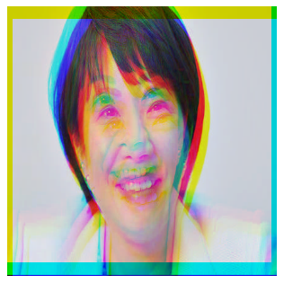

# chromatic_aberration

## 概要

JavaScriptで色収差(色ずれ)フィルターを実装します。



## コード

```js
/**
 * 色収差(色ずれ)フィルターを適用します
 *
 * @param {CanvasRenderingContext2D} ctx - 2D描画コンテキスト
 * @param {number} x - 描画領域のX座標
 * @param {number} y - 描画領域のY座標
 * @param {number} width - 描画領域の幅
 * @param {number} height - 描画領域の高さ
 * @param {number} dx - 水平方向のずれ
 * @param {number} dy - 垂直方向のずれ
 */
const chromaticAberration = (ctx, x, y, width, height, dx, dy) => {
    let imageData = ctx.getImageData(x, y, width, height);
    let originalData = new Uint8ClampedArray(imageData.data); // 元データをコピー
    let data = imageData.data;

    for (let y0 = 0; y0 < height; ++y0) {
        for (let x0 = 0; x0 < width; ++x0) {
            let targetIdx = (x0 + y0 * width) * 4;

            // --- 赤チャンネル (R) を +dx, +dy ずらす ---
            let rx = x0 + dx;
            let ry = y0 + dy;
            if (rx >= 0 && rx < width && ry >= 0 && ry < height) {
                let rIdx = (rx + ry * width) * 4;
                data[targetIdx + 0] = originalData[rIdx + 0];
            } else {
                data[targetIdx + 0] = 0;
            }

            // --- 緑チャンネル (G) はそのまま ---
            data[targetIdx + 1] = originalData[targetIdx + 1];

            // --- 青チャンネル (B) を -dx, -dy ずらす ---
            let bx = x0 - dx;
            let by = y0 - dy;
            if (bx >= 0 && bx < width && by >= 0 && by < height) {
                let bIdx = (bx + by * width) * 4;
                data[targetIdx + 2] = originalData[bIdx + 2];
            } else {
                data[targetIdx + 2] = 0;
            }

            // アルファ値は維持
            data[targetIdx + 3] = originalData[targetIdx + 3];
        }
    }

    ctx.putImageData(imageData, x, y);
};

// 描画する関数
const render = () => {
    // キャンバスのサイズ
    let width = canvas.width, height = canvas.height;
    // 経過時間を計算
    let new_time = (new Date()).getTime();
    let diff_time = (new_time - time) / 1000.0; // 秒単位
    time = new_time; // 時刻を更新

    // 黒で塗りつぶす
    ctx.clearRect(0, 0, width, height);

    // 画像を描画
    if (img.complete)
      ctx.drawImage(img, 0, 0);

    // 回転するずれを計算
    const dx = Math.round(15 * Math.cos(time / 250));
    const dy = Math.round(15 * Math.sin(time / 250));

    // 色収差(色ずれ)フィルターを適用
    chromaticAberration(ctx, 0, 0, width, height, dx, dy);

    // 次のアニメーションフレームを要求する
    if (anime)
        anime = window.requestAnimationFrame(render);
};

// アニメーションを開始する
anime = window.requestAnimationFrame(render);
```
